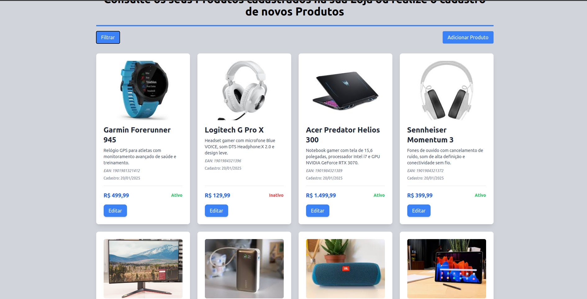
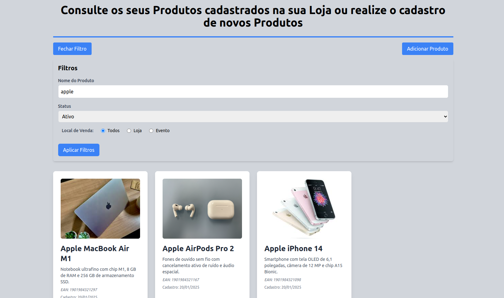
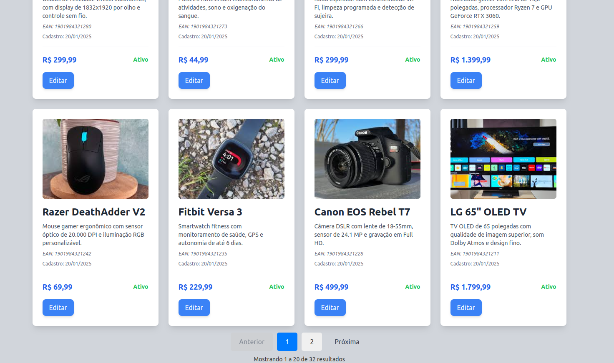
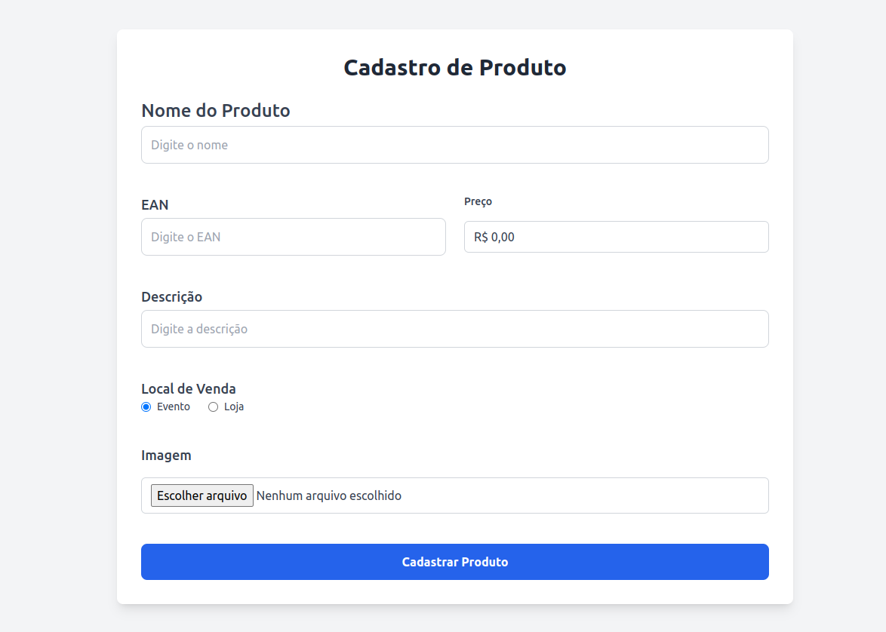
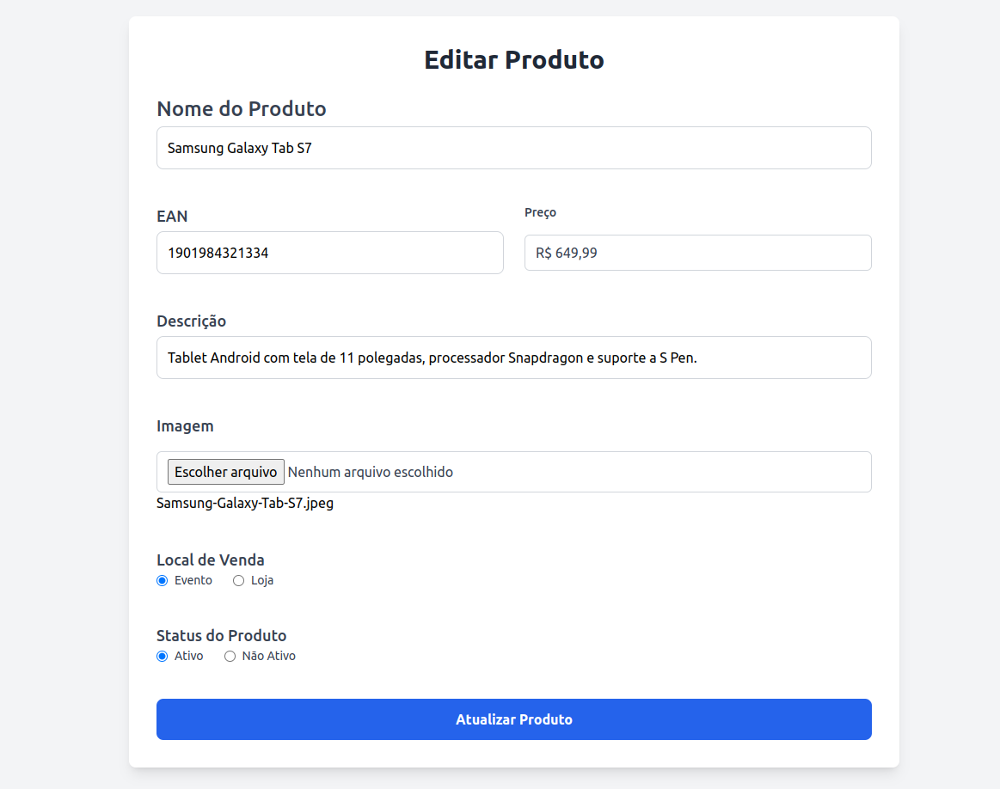

# APP de Cadastro de Produtos 📦

## Descrição

Este é o frontend desenvolvido utilizando **React** e **Vite**, que consome a API **[LuizaLabs API](https://github.com/HugooSantos/luizaLabs-api)** para gerenciar e exibir os produtos cadastrados.

## Overview do Projeto 🌍

### Tela inicial 🏠

A tela inicial apresenta uma lista de produtos com paginação, permitindo visualizar um número limitado de itens por vez. A navegação entre as páginas é fácil, facilitando a busca e o gerenciamento de produtos.



### Filtros 🔍

A tela inicial oferece filtros para facilitar a busca de produtos. Você pode procurar por nome, filtrar por status de ativo (ativo ou inativo) e escolher o local de venda.



### Paginação 📑

A paginação permite que os resultados sejam exibidos em várias páginas, facilitando a navegação por grandes volumes de produtos. Você pode navegar entre as páginas utilizando os controles de página, melhorando a experiência ao visualizar os produtos de forma organizada e eficiente.



### Criação dos Produtos ➕

A tela de criação de produtos permite adicionar novos itens ao sistema. Nela, você pode preencher informações essenciais como nome, imagem, EAN, preço, descrição e localização de venda do produto. Após o preenchimento dos campos obrigatórios, é possível salvar o produto, que será automaticamente adicionado ao banco de dados e ficará disponível para consulta e manipulação.



### Edição dos Produtos ✏️

A tela de edição de produtos permite modificar as informações de um produto existente. Você pode atualizar campos como nome, imagem, EAN, preço, descrição e localização de venda. Ao fazer alterações, basta salvar as mudanças para que elas sejam atualizadas no banco de dados.



## Tecnologias e Bibliotecas Utilizadas 🛠️

- **React**: Biblioteca para construção de interfaces de usuário.
- **Vite**: Ferramenta de build e desenvolvimento rápido para projetos frontend.
- **TailwindCSS**: Framework CSS para criação de layouts rápidos e responsivos.
- **Formik**: Biblioteca para criação e gerenciamento de formulários em React.
- **Yup**: Biblioteca para validação de esquemas de dados.
- **React Router DOM**: Biblioteca para navegação entre páginas em uma aplicação React.
- **React Icons**: Conjunto de ícones para uso em projetos React.
- **React Toastify**: Biblioteca para exibição de notificações no frontend.
- **TypeScript**: Superset do JavaScript que adiciona tipagem estática.
- **ESLint**: Ferramenta para identificar e corrigir problemas no código JavaScript/TypeScript.


## Como Executar 🏃‍♂️
    
1. **Clonar e Instalar Dependências**
    
    via ssh:
    ```bash
    git clone git@github.com:HugooSantos/luizaLabs-app.git
    ```
    via https:

    ```bash
    git clone https://github.com/HugooSantos/luizaLabs-app.git
    ```
    
    entre no diretorio:

    ```bash
    cd luizaLabs-app
    ```

    Copie o arquivo .env.example para um novo arquivo .env e adicione as informações da url da api, caso use a api citada somente copiar:
    ```bash
    cp .env.example .env
    ```

2. **Verificar a Versão do Node.js**: 

   Este projeto foi desenvolvido utilizando o Node.js 18.x.x. Para garantir que você está utilizando a versão correta, execute:

   ```bash
   node -v
   ```

   Caso a versão do Node.js não seja a recomendada, você pode usar o nvm (Node Version Manager) para gerenciar diferentes versões do Node. Para instalar a versão correta, execute:

   ```bash
   nvm install 18
   nvm use 18
   ```

3. **Instalar as Dependências**:

   Após garantir que você está utilizando a versão correta do Node.js, instale as dependências do projeto:

   ```bash
   npm install
   ```

4. **Rodar o Projeto em Ambiente de Desenvolvimento**:
  
   Agora, você pode rodar o projeto em modo de desenvolvimento. Execute o seguinte comando:
 
   ```bash
   npm run dev
   ```
   